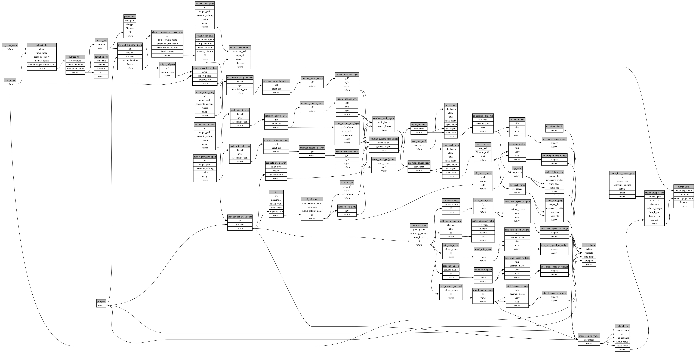

```
# AUTOGENERATED BY ECOSCOPE-WORKFLOWS; see fingerprint in README.md for details

```

```yaml
# fingerprint:
artifacts_sha256_basic: 5c72ae94189d53a2fe19b565ca76d411753ff026f260509a08a8b76d488a3188
artifacts_sha256_strict: c4f9c684ac138a8c0ef9e078485dc72915f5f2eb1cea7bac0f0c22d90c5c0327
installed_requirements:
- channel: https://repo.prefix.dev/ecoscope-workflows/
  name: ecoscope-workflows-core
  version: {version: ==0.21.4}
- channel: https://repo.prefix.dev/ecoscope-workflows/
  name: ecoscope-workflows-ext-ecoscope
  version: {version: ==0.21.4}
- channel: https://repo.prefix.dev/ecoscope-workflows-custom/
  name: ecoscope-workflows-ext-custom
  version: {version: ==0.0.22}
- channel: https://repo.prefix.dev/ecoscope-workflows-custom/
  name: ecoscope-workflows-ext-ste
  version: {version: ==0.0.7}
- channel: https://repo.prefix.dev/ecoscope-workflows-custom/
  name: ecoscope-workflows-ext-mnc
  version: {version: ==0.0.0}
- channel: file:///tmp/ecoscope-workflows-custom/release/artifacts/
  name: ecoscope-workflows-ext-lion-guardians
  version: {version: ==0.0.5.dev4+g377efb1dd.d20260202}
params_sha256: 760731025c3a7b435e3273b22f58cdac072dc29d2934518d3ba0e91f574a8b1d
spec_sha256: bb267d6043aa20970718ae0c6748350df78451e779b7e800b34cd0c0212001e2

```

# ecoscope-workflows-collared-lions-workflow


