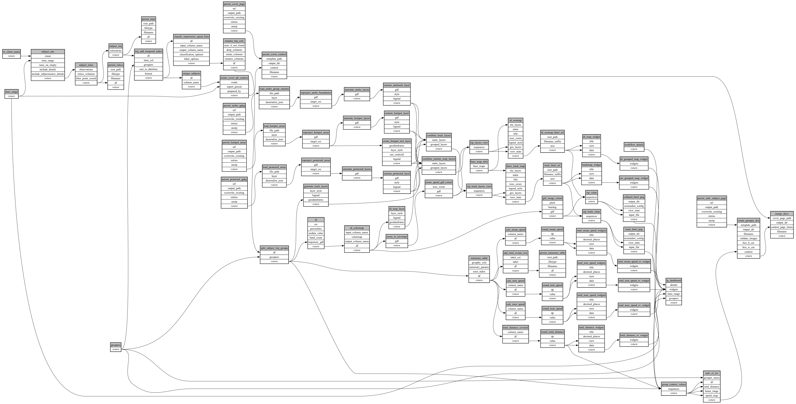

```
# AUTOGENERATED BY ECOSCOPE-WORKFLOWS; see fingerprint in README.md for details

```

```yaml
# fingerprint:
artifacts_sha256_basic: 23d40269875badddb1c677c59a18ceb558d7792e43aa409b896ee67e9c8892c2
artifacts_sha256_strict: 5c6d560868a38cfd61d875534e2d91fe514e8146ae180a1a2d57c7c2664d7ccf
installed_requirements:
- channel: https://repo.prefix.dev/ecoscope-workflows/
  name: ecoscope-workflows-core
  version: {version: ==0.22.9}
- channel: https://repo.prefix.dev/ecoscope-workflows/
  name: ecoscope-workflows-ext-ecoscope
  version: {version: ==0.22.9}
- channel: https://repo.prefix.dev/ecoscope-workflows-custom/
  name: ecoscope-workflows-ext-custom
  version: {version: ==0.0.28}
- channel: https://repo.prefix.dev/ecoscope-workflows-custom/
  name: ecoscope-workflows-ext-ste
  version: {version: ==0.0.17}
- channel: https://repo.prefix.dev/ecoscope-workflows-custom/
  name: ecoscope-workflows-ext-mnc
  version: {version: ==0.0.7}
- channel: https://repo.prefix.dev/ecoscope-workflows-custom/
  name: ecoscope-workflows-ext-lion-guardians
  version: {version: ==0.0.5}
params_sha256: b748c9e2830b7c7a80399dcbd25fe3d8a6a8f5af4b6abcccd41641df8f18d7e2
spec_sha256: d3eb898e10bed4ed3d7cea3d5879b7bceac444c58a71a9bee7ce0fdd498afeb4

```

# ecoscope-workflows-collared-lions-workflow


