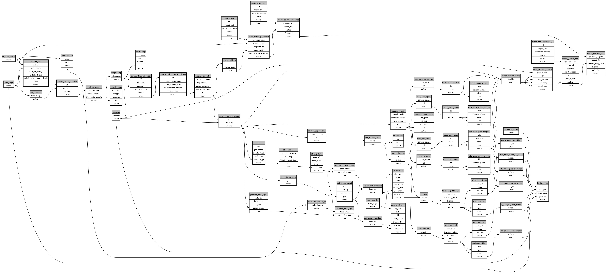

```
# AUTOGENERATED BY ECOSCOPE-WORKFLOWS; see fingerprint in README.md for details

```

```yaml
# fingerprint:
artifacts_sha256_basic: bfa894938be656f29d2d43c694c818e6c99d8c0e75edf7c51672774133b96d9b
artifacts_sha256_strict: 1b6d4d89d923967003e415e4440ee94f1a4742635a3a940fd54abefa950f1cd0
installed_requirements:
- channel: https://repo.prefix.dev/ecoscope-workflows/
  name: ecoscope-platform
  version: {version: ==2.15.1}
- channel: https://repo.prefix.dev/ecoscope-workflows-custom/
  name: ecoscope-workflows-ext-custom
  version: {version: ==0.1.0rc14}
- channel: https://repo.prefix.dev/ecoscope-workflows-custom/
  name: ecoscope-workflows-ext-ste
  version: {version: ==0.0.0rc1}
- channel: file:///tmp/ecoscope-workflows-custom/release/artifacts/
  name: ecoscope-workflows-ext-lion-guardians
  version: {version: ==0.0.8.dev3+gc9df14f74.d20260721}
- channel: conda-forge
  name: pydeck
  version: {version: ==0.9.2}
- channel: conda-forge
  name: opentelemetry-sdk
  version: {version: ==1.44.0}
params_sha256: 7a97c32345140c32c13d944680362c0a9df137a7f573b176603de62b8cb4641c
spec_sha256: 68c57e7772ebc9a807aed9a5c0e792b140094cc5e16175684082d61bb28638d8

```

# ecoscope-workflows-collared-lions-workflow


