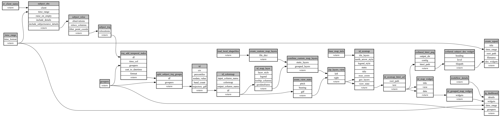

```
# AUTOGENERATED BY ECOSCOPE-WORKFLOWS; see fingerprint in README.md for details

```

```yaml
# fingerprint:
artifacts_sha256_basic: 2dbddb40b9ef35f21eea73b317cf9eee78f87b963cf15d5d0309b67c7bb51ba8
artifacts_sha256_strict: d8543452051783656663a0e1d01ee250ca25dad241c16c574ac81292ffe43cd6
installed_requirements:
- channel: https://repo.prefix.dev/ecoscope-workflows/
  name: ecoscope-workflows-core
  version: {version: ==0.7.2}
- channel: https://repo.prefix.dev/ecoscope-workflows-custom/
  name: ecoscope-workflows-ext-custom
  version: {version: ==0.0.3}
- channel: file:///tmp/ecoscope-workflows-custom/release/artifacts/
  name: ecoscope-workflows-ext-lion-guardians
  version: {version: ==10000.dev19+g149a232e3.d20250903}
params_sha256: 463c84203942426dce11a179994a42abb343bc9a64524de3f8af4b98f97d6278
spec_sha256: c7272b85d4a5ab5d4aa5c9d269f5ae18a31c327a14ba91ec92d6e66bf61d31e8

```

# ecoscope-workflows-collared-lions-report-workflow


