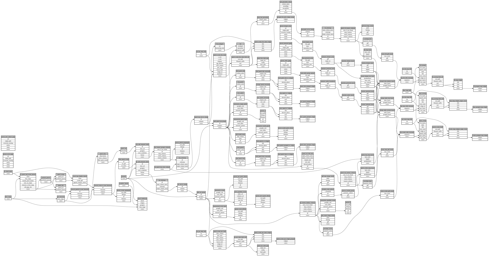

```
# AUTOGENERATED BY ECOSCOPE-WORKFLOWS; see fingerprint in README.md for details

```

```yaml
# fingerprint:
artifacts_sha256_basic: a99c73c02b7a5107dc36e8d5e5a83dffd065070146f8deab1831e8274349b515
artifacts_sha256_strict: 10cdfe7f808df3ed9c70cba297c7cc8a8493ff6a464536cd9bf7ba470621271a
installed_requirements:
- channel: https://repo.prefix.dev/ecoscope-workflows/
  name: ecoscope-workflows-core
  version: {version: ==0.20.4}
- channel: https://repo.prefix.dev/ecoscope-workflows/
  name: ecoscope-workflows-ext-ecoscope
  version: {version: ==0.20.4}
- channel: https://repo.prefix.dev/ecoscope-workflows-custom/
  name: ecoscope-workflows-ext-custom
  version: {version: ==0.0.20}
- channel: https://repo.prefix.dev/ecoscope-workflows-custom/
  name: ecoscope-workflows-ext-ste
  version: {version: ==0.0.6}
- channel: https://repo.prefix.dev/ecoscope-workflows-custom/
  name: ecoscope-workflows-ext-mnc
  version: {version: ==0.0.0}
- channel: https://repo.prefix.dev/ecoscope-workflows-custom/
  name: ecoscope-workflows-ext-icf
  version: {version: ==0.0.0}
- channel: file:///tmp/ecoscope-workflows-custom/release/artifacts/
  name: ecoscope-workflows-ext-lion-guardians
  version: {version: ==0.0.4.dev1+g61e767c64.d20260126}
params_sha256: 8c34deecae2fc9539b1cce57df226c5b4b2c203a14402c36d11371fbf38291fb
spec_sha256: 4e2e1da01fa91a1106f7a2e02fc2f4cec50d1ecc35842b35b33a35c64b8a7c23

```

# ecoscope-workflows-guardians-report-workflow


