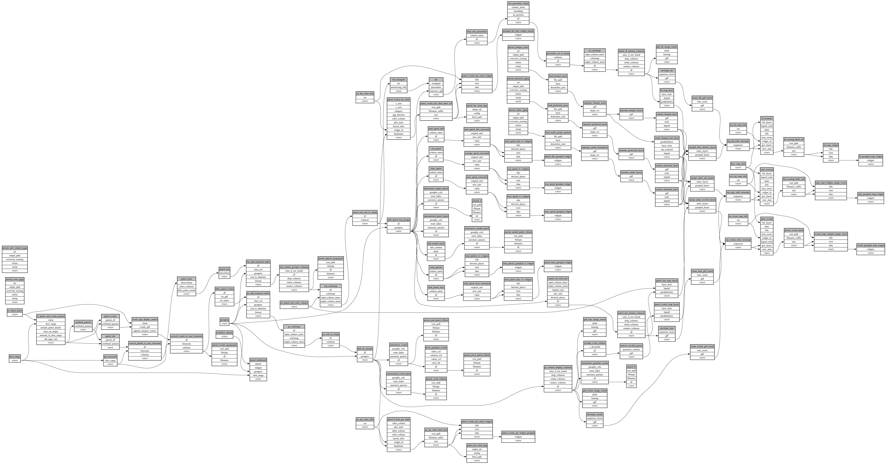

```
# AUTOGENERATED BY ECOSCOPE-WORKFLOWS; see fingerprint in README.md for details

```

```yaml
# fingerprint:
artifacts_sha256_basic: c242b130fe087044862f355218968b468bdc23d5852e10b17618546df56ac5da
artifacts_sha256_strict: 4311513b60a57c881f75628bf3b7a752925cfcb37e1c296cb36e40b1a13d6ba3
installed_requirements:
- channel: https://repo.prefix.dev/ecoscope-workflows/
  name: ecoscope-workflows-core
  version: {version: ==0.22.9}
- channel: https://repo.prefix.dev/ecoscope-workflows/
  name: ecoscope-workflows-ext-ecoscope
  version: {version: ==0.22.9}
- channel: https://repo.prefix.dev/ecoscope-workflows-custom/
  name: ecoscope-workflows-ext-custom
  version: {version: ==0.0.28}
- channel: https://repo.prefix.dev/ecoscope-workflows-custom/
  name: ecoscope-workflows-ext-ste
  version: {version: ==0.0.17}
- channel: https://repo.prefix.dev/ecoscope-workflows-custom/
  name: ecoscope-workflows-ext-mnc
  version: {version: ==0.0.7}
- channel: https://repo.prefix.dev/ecoscope-workflows-custom/
  name: ecoscope-workflows-ext-icf
  version: {version: ==0.0.0}
- channel: https://repo.prefix.dev/ecoscope-workflows-custom/
  name: ecoscope-workflows-ext-lion-guardians
  version: {version: ==0.0.6}
params_sha256: da2645f576d0672056f973d1e232614e42e5eff65f47497547b5257d984aeda0
spec_sha256: 935abfd9ad970cd660a3056b49b7f47e8719a4e15932cd7c1b0c0632310e55e4

```

# ecoscope-workflows-guardians-report-workflow


