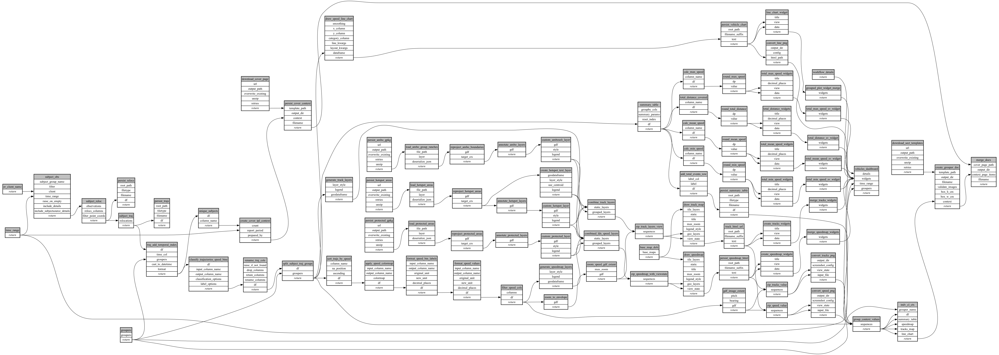

```
# AUTOGENERATED BY ECOSCOPE-WORKFLOWS; see fingerprint in README.md for details

```

```yaml
# fingerprint:
artifacts_sha256_basic: bf49fcd9534ffdbd0555bdba8fb4e06bfd71704ede972a06c439ad510d6bc1e0
artifacts_sha256_strict: 6de43bc8e19b552e994a234693ec967431f8e72c12d4cf13964ef4ce77fcef54
installed_requirements:
- channel: https://repo.prefix.dev/ecoscope-workflows/
  name: ecoscope-workflows-core
  version: {version: ==0.21.4}
- channel: https://repo.prefix.dev/ecoscope-workflows/
  name: ecoscope-workflows-ext-ecoscope
  version: {version: ==0.21.4}
- channel: https://repo.prefix.dev/ecoscope-workflows-custom/
  name: ecoscope-workflows-ext-custom
  version: {version: ==0.0.22}
- channel: https://repo.prefix.dev/ecoscope-workflows-custom/
  name: ecoscope-workflows-ext-ste
  version: {version: ==0.0.7}
- channel: https://repo.prefix.dev/ecoscope-workflows-custom/
  name: ecoscope-workflows-ext-mnc
  version: {version: ==0.0.0}
- channel: https://repo.prefix.dev/ecoscope-workflows-custom/
  name: ecoscope-workflows-ext-icf
  version: {version: ==0.0.0}
- channel: https://repo.prefix.dev/ecoscope-workflows-custom/
  name: ecoscope-workflows-ext-lion-guardians
  version: {version: ==0.0.5}
params_sha256: 229d58d9dc7c36c3a8a7e05c33136a1ec0a8caec5d04df328af2d29ad654c3bc
spec_sha256: c98e3b5563428dcdf9d126ff00a774af1d0cbca77ad0ce02e65bb79c539c91c2

```

# ecoscope-workflows-vehicles-report-workflow


