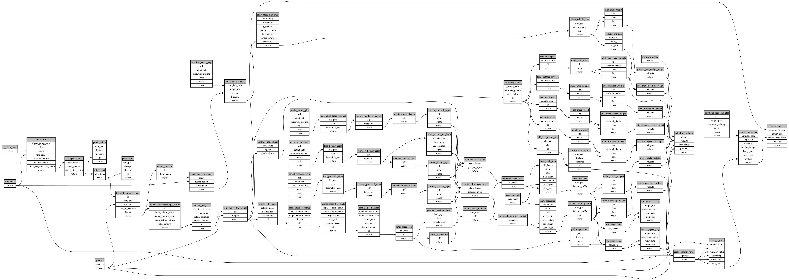

```
# AUTOGENERATED BY ECOSCOPE-WORKFLOWS; see fingerprint in README.md for details

```

```yaml
# fingerprint:
<<<<<<< HEAD
artifacts_sha256_basic: 03890cbb7b622c1b38e288b8f034e5044ee438da027a8e2786f1af2f4e036f89
artifacts_sha256_strict: 5a1d42b72c5324a317702516b216a01c14b698502d7fed0148e46f38a89a4547
=======
artifacts_sha256_basic: bf49fcd9534ffdbd0555bdba8fb4e06bfd71704ede972a06c439ad510d6bc1e0
artifacts_sha256_strict: 6de43bc8e19b552e994a234693ec967431f8e72c12d4cf13964ef4ce77fcef54
>>>>>>> main
installed_requirements:
- channel: https://repo.prefix.dev/ecoscope-workflows/
  name: ecoscope-workflows-core
  version: {version: ==0.22.9}
- channel: https://repo.prefix.dev/ecoscope-workflows/
  name: ecoscope-workflows-ext-ecoscope
  version: {version: ==0.22.9}
- channel: https://repo.prefix.dev/ecoscope-workflows-custom/
  name: ecoscope-workflows-ext-custom
  version: {version: ==0.0.28}
- channel: https://repo.prefix.dev/ecoscope-workflows-custom/
  name: ecoscope-workflows-ext-ste
  version: {version: ==0.0.17}
- channel: https://repo.prefix.dev/ecoscope-workflows-custom/
  name: ecoscope-workflows-ext-mnc
  version: {version: ==0.0.7}
- channel: https://repo.prefix.dev/ecoscope-workflows-custom/
  name: ecoscope-workflows-ext-icf
  version: {version: ==0.0.0}
- channel: https://repo.prefix.dev/ecoscope-workflows-custom/
  name: ecoscope-workflows-ext-lion-guardians
  version: {version: ==0.0.5}
<<<<<<< HEAD
params_sha256: 85262d2e1a1cce89d9c30e7dc7e159b709f92dccbdfe4b6e6ab2462dfb56e62c
spec_sha256: de25b6a3751fbeb55cd9864e72c2d7c3e0ffa28789f3862aeb59245e915c1656
=======
params_sha256: 229d58d9dc7c36c3a8a7e05c33136a1ec0a8caec5d04df328af2d29ad654c3bc
spec_sha256: c98e3b5563428dcdf9d126ff00a774af1d0cbca77ad0ce02e65bb79c539c91c2
>>>>>>> main

```

# ecoscope-workflows-vehicles-report-workflow


