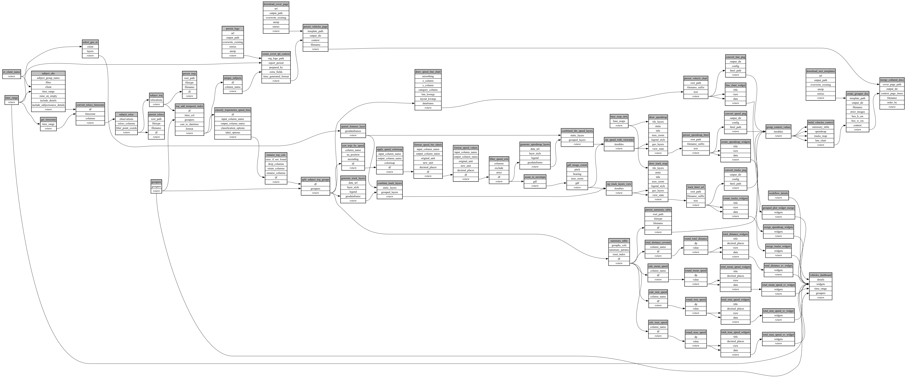

```
# AUTOGENERATED BY ECOSCOPE-WORKFLOWS; see fingerprint in README.md for details

```

```yaml
# fingerprint:
artifacts_sha256_basic: c4e3e3ca02e6960a6a6fb1815877686dd4b3bf78939975c18ae01486ecbf71a7
artifacts_sha256_strict: b12738981ba20c17a472d3410408a19a01ecf67dad5ecd23e376a61fbbfdface
installed_requirements:
- channel: https://repo.prefix.dev/ecoscope-workflows/
  name: ecoscope-platform
  version: {version: ==2.15.1}
- channel: https://repo.prefix.dev/ecoscope-workflows-custom/
  name: ecoscope-workflows-ext-custom
  version: {version: ==0.1.0rc14}
- channel: https://repo.prefix.dev/ecoscope-workflows-custom/
  name: ecoscope-workflows-ext-ste
  version: {version: ==0.0.0rc1}
- channel: file:///tmp/ecoscope-workflows-custom/release/artifacts/
  name: ecoscope-workflows-ext-lion-guardians
  version: {version: ==0.0.8.dev3+gc9df14f74.d20260721}
- channel: conda-forge
  name: pydeck
  version: {version: ==0.9.2}
- channel: conda-forge
  name: opentelemetry-sdk
  version: {version: ==1.44.0}
params_sha256: 8ec66f689124f09fdc0b9e58fd0668d6d6a9a023df19834cdf059202d17289b4
spec_sha256: cdc9c4b7eafe10503add31fcffa3037d28e3a11db3565d5aaf70a2426fb0d3b9

```

# ecoscope-workflows-vehicles-report-workflow


